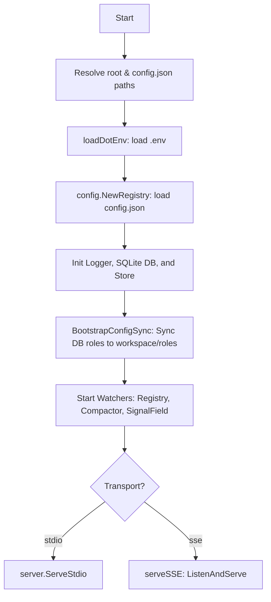
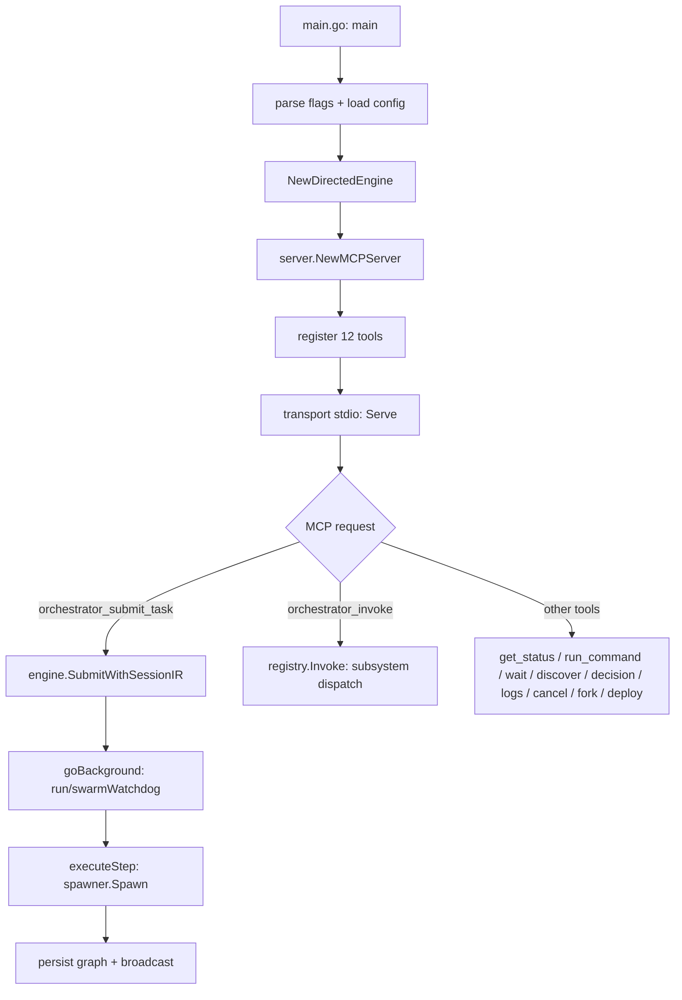
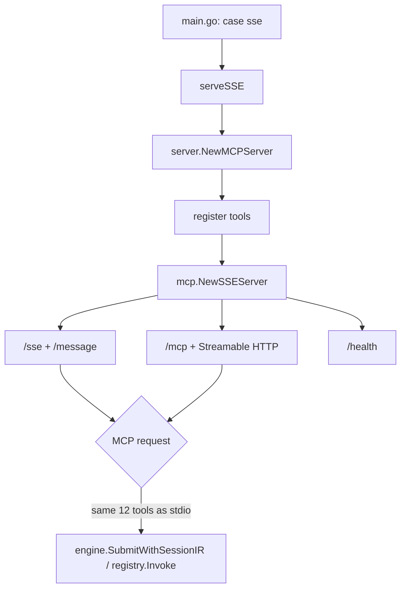
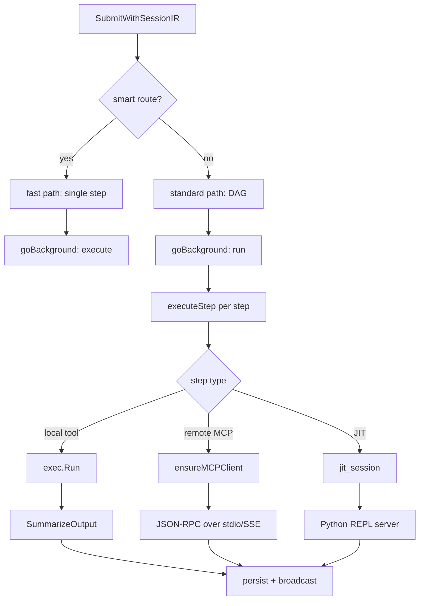
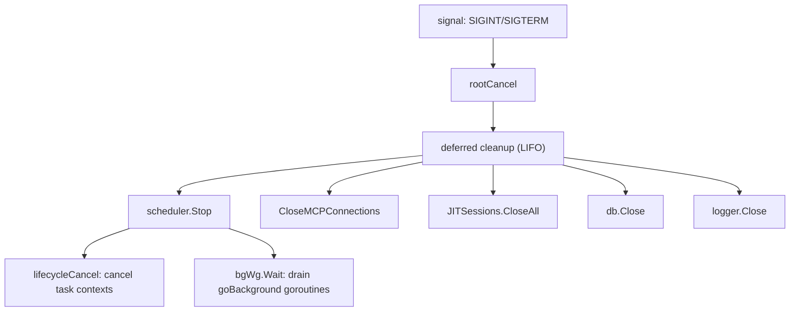
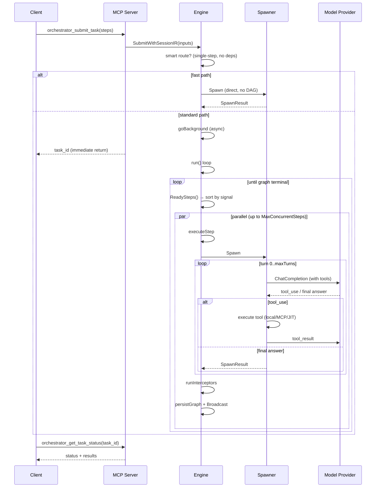
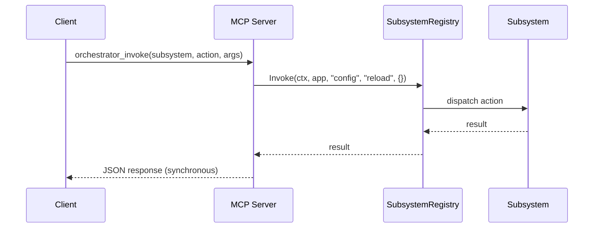
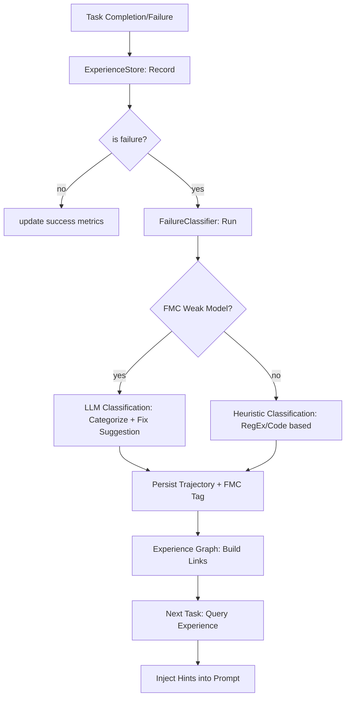

# Architecture Flows — Open Core (stdio + raw SSE)

This document maps the entry chains and operation pathways in the public
`vortex` repository.

> [!NOTE]
> For configuration details, see [CONFIGURATION.md](CONFIGURATION.md). For agent-specific guidance, see [AGENTS.md](../AGENTS.md).

## 0. Bootstrapping & Initialization

Initialization is "environment-aware": it searches for `config.json` relative to the executable or working directory, and respects `VORTEX_CONFIG` and `VORTEX_DB_PATH` overrides. The registry starts a background watcher to hot-reload config changes.

Tools registered (12): `orchestrator_submit_task`, `orchestrator_get_task_status`,
`orchestrator_wait_task`, `orchestrator_run_command`, `orchestrator_discover`,
`orchestrator_submit_decision`, `orchestrator_get_logs`, `orchestrator_invoke`,
`orchestrator_cancel_task`, `orchestrator_fork_task`, `orchestrator_admin_deploy`,
`orchestrator_context_search` (conditional). The Promoter may hot-promote
frequently-used subsystem actions to top-level tools at runtime.

## 2. Raw SSE Transport (Fallback)

No auth, no tiering, no `/api/*` routes. A single full MCP server is
exposed over SSE + Streamable HTTP. This is the open fallback for
environments where stdio is impractical (e.g. remote containers).

## 3. Task Execution Flow

## 4. Shutdown Flow

Task goroutines are tracked via `goBackground` and derive their context
from `lifecycleCtx`, so `Stop()` cleanly drains all in-flight work
before the deferred cleanup closes MCP connections, JIT sessions,
database, and logger.

---

## 5. Task Submission Sequence

The async boundary is at `goBackground`: `SubmitWithSessionIR` returns
`task_id` immediately while the DAG executes in a background goroutine.
Clients poll `orchestrator_get_task_status` for results.

## 6. Invoke Sequence (synchronous)

## 7. Experience & FMC (Failure Mode Classification)

FMC (Failure Mode Classification) allows the engine to "learn" from mistakes. When a task fails, it is passed through a classifier (ideally a cheap "weak model" like Gemini Flash) to determine the root cause (e.g., `TIMEOUT`, `API_ERROR`, `LOGIC_ERROR`) and store a potential correction. This correction is then surfaced as a "Hint" to the sub-agent if a similar task is submitted in the future.

Unlike `submit_task`, `invoke` is synchronous — the MCP call blocks
until the subsystem action completes. Subsystems: `config`, `jit`,
`admin`, `schedule`, `exp`, `intel`, `proxy`. The Promoter may
hot-promote frequently-invoked actions to top-level tools.
